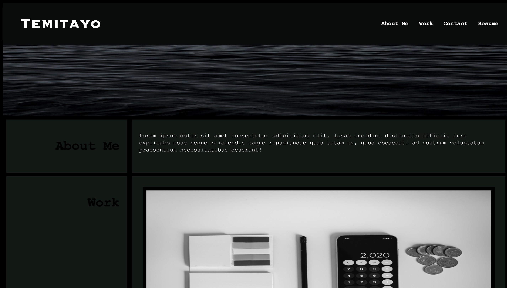

In this assignment I was challenged to create my very own portfolio page. My motivation for this assignment was to create a portfolio page that both demonstrated the skills needed to work in the tech indusrty and to better my CSS and HTML skills. My motivation for this assignment was to be able to create my very first webpage that will contain my future work and showcase my skills to future employers and coworkers. I learned how to sucessfully use grid layouts to correctly layout my each section on my page, as well as using hover effects.

[Link to deployed webpage](https://temifemi.github.io/temisportfolio/)

## Screenshot of Portfolio Website

 